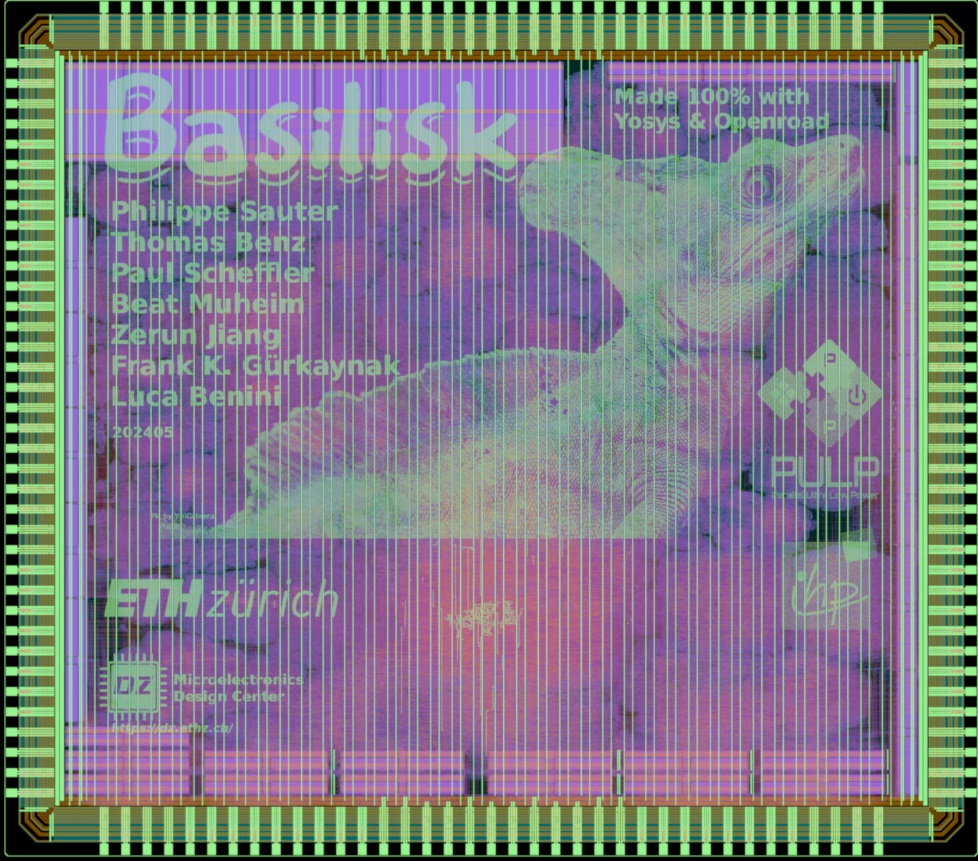
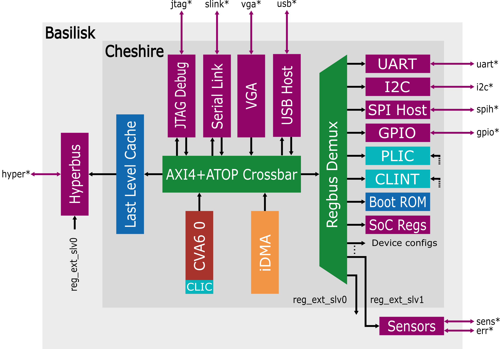

# Basilisk Tapeout (May 2024)

Basilisk is a tapeout of [Cheshire-IHP130-o](https://github.com/pulp-platform/cheshire-ihp130-o) which is an implementation of the [Cheshire SoC platform](https://github.com/pulp-platform/cheshire) in IHP130 using only open-source tools from RTL to GDS. 

Basilisk (Cheshire-IHP-130-o) is developed as part of the PULP project, a joint effort between ETH Zurich and the University of Bologna. 

**Important:**
For the newest version, visit the [Cheshire-IHP130-o](https://github.com/pulp-platform/cheshire-ihp130-o) repository. It includes a guide to acquiring all the tools and scripts necessary to build the chip.

## Architecture
The chip contains a Linux-capable RISC-V core and a suite of peripherals from a Hyperbus RAM interface, over a USB host to I2C.

Basilisk uses commercial IO cells as well as sensor cells that are not open-source, to protect the IP these cells are not included in the GDS.

## Files
- `design_data/rtl/basilisk.morty.sv`: pickled SystemVerilog source code
- `design_data/rtl/basilisk.svase.sv`: simplified SystemVerilog source code
- `design_data/rtl/basilisk.sv2v.v`: source code converted to Verilog
- `design_data/basilisk.yosys.v`: netlist from Yosys synthesis tool
- `design_data/basilisk.final.v`: final netlist from OpenROAD (with some scripted renaming of instances)
- `design_data/basilisk.gds`: final GDS
- `doc/basilisk_bonding.pdf`: bonding diagram with pad names

Big files compressed (and gds also split) to get below githubs file-size limit of 100MB.  
Use `unzip design_data/basilisk.gds.zip` to unzip.
