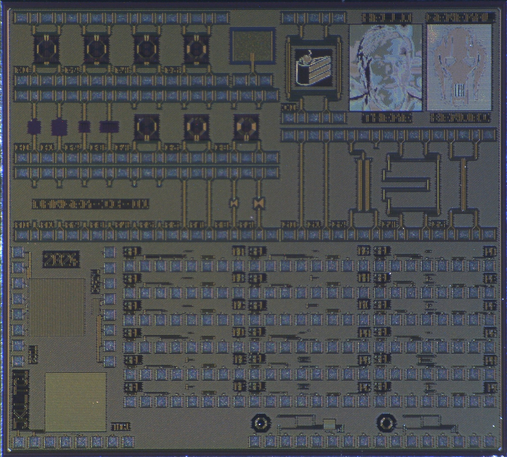
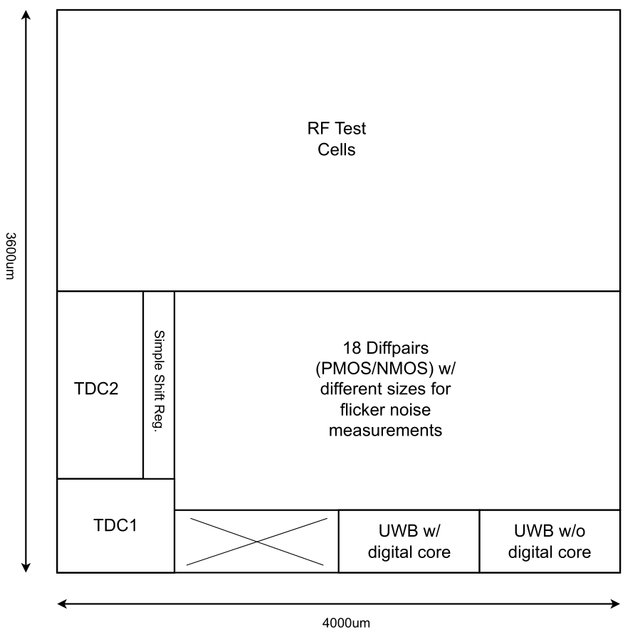
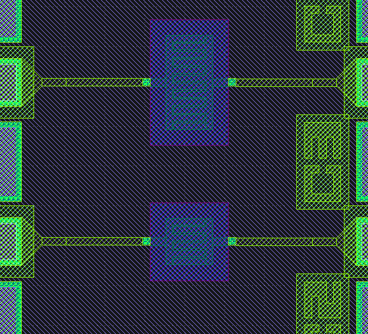

# JKU Test Chip 1 (May 2024)

This chip was designed by the Department for Integraed Circuits (ICD) from Johannes Kepler University Linz. It contains several test structures.

## mmWave 

Designed by Daniel Gerlicher

mmWave RF structures generated with a custom python script using GDSFactory. 

### List of RF structures

- Calibration structures

- Inductors

- Mim and Mom capacitors

- Patch antenna

- Transformers

- Transmission lines

- Ratrace

### Simulation Results

See `JKU_TC1/doc/rf_sim/`

### S-Parameter Measurement Results

See `JKU_TC1/doc/rf_meas.zip`

### Issues

#### Mom Capacitors

One comb of the mom capacitors is mission on TM1, even though it was present in the layout. 

## Sfl-test-cells

Designed by Michael Koefinger

The flicker noise test cells are located in the lower half of the chip. Each cell consists of a differential pair, a tail current source, an ID resistor and 8 analog pads for probing. 

### Cells

The following transistor dimensions (sg13_lv_nmos/sg13_lv_pmos) got selected:

| Width (um) | Length (um) | Chip marking NMOS/PMOS | ID Resistor NMOS/PMOS (Ohm)  |
| :----------: | :-----------: | :------------: | :------------------: |
|     10     |    0.13     |     na/pa    |      1.0k/5.6k     |
|     10     |    5        |     nb/pb    |      1.2k/6.8k     |
|     10     |    10       |     nc/pc    |      1.5k/8.2k     |
|     50     |    0.13     |     nd/pd    |      1.8k/10k     |
|     50     |    5        |     ne/pe    |      2.2k/12k     |
|     50     |    10       |     nf/pf    |      2.7k/15k     |
|     100    |    0.13     |     ng/pg    |      3.3k/18k     |
|     100    |    5        |     nh/ph    |      3.9k/22k     |
|     100    |    10       |     ni/pi    |      4.7k/27k     |

### Pads

| PAD (first is left)  | Description           | Value          |
| :------------------ | :------------------- |  :----------- |
|     VDD              |    Pos. supply terminal     |   1.2V         |
|     ID_N              |    Neg. current output of diff. pair, requires a (resistive) load    |   N.A        |
|     ID_P              |    Pos. current output of diff. pair, requires a (resistive) load    |   N.A        |
|     VG_P              |    Pos. input of diff. pair    |  Vcm = 0.6V       |
|     VG_N              |    Neg. input of diff. pair    |  Vcm = 0.6V       |
|     VSS              |    Neg. supply terminal     |   0V         |
|     VBIAS           |    Bias voltage for tail current source    |   see table below        |
|     VRES_ID         |    Measure ID resistor to ground    |    max. 3mA, stay below this limit!     |

### Tail current source bias voltages

| IBIAS (mA)  | Type           | VBIAS (V)          |
| :------------------: | :-------------------: |  :-----------: |
| 0.01               |   NMOS          |   0.14          |
| 0.10               |   NMOS          |   0.24          |
|1.0                |   NMOS          |   0.44          |
|10.0               |   NMOS          |   1.0         |
| 0.01               |   PMOS          |   0.95          |
| 0.10               |   PMOS          |   0.87          |
|1.0                |   PMOS          |   0.46         |
|5.0                |   PMOS          |   -0.07         |
|10.0               |   PMOS          |   -0.53         |

### Proposed Measurement Setup

1. Select load resistors for ID_P and ID_N and VBIAS for the tail current source to set desired bias point

2. Find gm by measuring the differential voltage gain with a small differential input signal at VG_P and VG_N.

3. Measure the power spectral density of the output current at ID_P and ID_N 

4. Calculate the flicker noise coefficient from the measured data and compare with simulation.

### Simulation of Test Cells

#### Setup

$R_\text{drain} = 680 \Omega$

$R_\text{load, meas} = 200\text{k}\Omega$ (input resistance of measurement device)

$f_\text{sig} = 1\text{kHz}$

$v_\text{sig} = 10\text{mV}$

$V_\text{cm} = 0.6\text{V}$

#### Modelling

$A_0 = g_\text{m} \cdot \left(R_\text{drain} || R_\text{load, meas} || r_\text{ds} \right) \approx g_\text{m} \cdot R_\text{drain}$

$\frac{\overline{V_\text{inoise}^2}}{\Delta f} = \frac{1}{\vert A_0\vert^2}\frac{\overline{V_\text{onoise}^2}}{\Delta f}$

$\frac{\overline{V_\text{inoise}^2}}{\Delta f} = \frac{K_\text{f}}{W \cdot L \cdot f}$

$K_\text{f,integ} = \frac{V_\text{inoise,rms}^2\cdot W\cdot L}{\ln{\vert f_2-f_1\vert}}$

$K_\text{f, spot} = \frac{\overline{V_\text{inoise}^2}}{\Delta f}\vert_{f_\text{spot}} \cdot W \cdot L\cdot f_\text{spot}$

#### Results for Cell *na* **10um/0.13um NMOS**, ID resistor 1k Ohm

| VBIAS (V)  | IBIAS (uA) |  gm-op (mS) | gm-tran (mS)  | Vonoise @ 1Hz (uV/sqrt(Hz)) | Vinoise @ 1Hz (uV/sqrt(Hz)) | Vonoise in 10kHz - 1Hz (uVrms) | Kf (V^2 * um^2) |
| :--------: | :--------: |  :--------: | :-----------: |:--------: |  :--------: | :-----------: |:--------: |  
| 0.2        |      45    |  0.48       |  0.47         | 2.4       |   7.24      |  7.2          |  68e-12         |
| 0.6        |      390   |  2.0       |  1.95          |15.8       |11.3         |48.0           | 165e-12|
| 0.8        |      424   |  2.2       |  2.0           |17.0       |11.3         |51.3           | 166e-12|

#### Results for Cell *ni* **100um/10um NMOS**, ID resistor 4.7k Ohm

| VBIAS (V)  | IBIAS (uA) |  gm-op (mS) | gm-tran (mS)  | Vonoise @ 1Hz (uV/sqrt(Hz)) | Vinoise @ 1Hz (uV/sqrt(Hz)) | Vonoise in 10kHz - 1Hz (uVrms) | Kf (V^2 * um^2) |
| :--------: | :--------: |  :--------: | :-----------: |:--------: |  :--------: | :-----------: |:--------: |  
| 0.2        |      47    |  0.330       |  0.329         | 0.15    |   0.68      |  0.7           |  1.3e-12         |
| 0.6        |      469   |  1.26       |  1.25          |0.66      |0.76         |2.1            |  0.83e-12|
| 0.8        |      500   |  1.3       |  1.29           |0.68      |0.77         |2.2            | 0.83e-12|

## Digital

Designed by Harald Pretl

- Simple shift register

- Time to digital converters (TDC1, TDC2)

## UWB Transmitter

Designed by Ali Olyanasab

Simple UWB transmitter with and without digital control